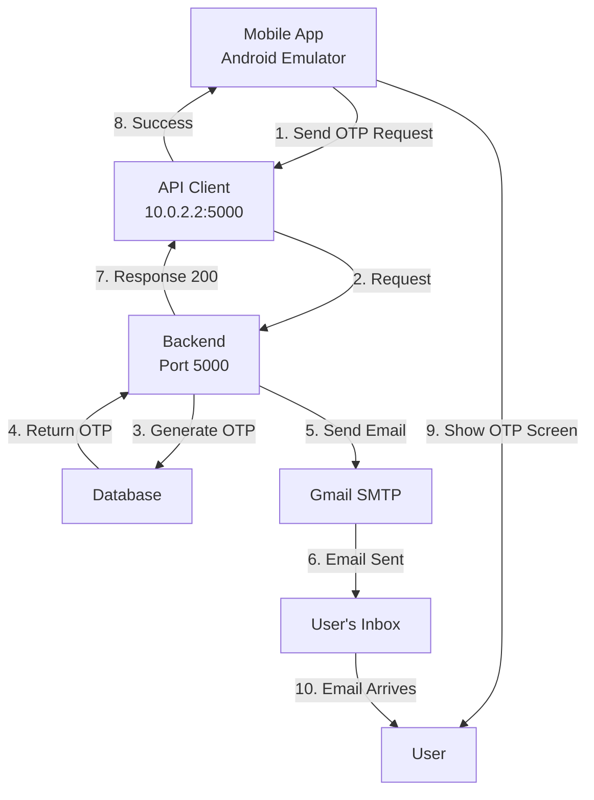

# ✅ All Errors & Warnings FIXED - Final Summary

**Date**: June 5, 2026  
**Errors Fixed**: 4 major issues  
**Status**: Ready for Testing

---

## 🔴 Errors Found and Fixed

### Error 1: Network Connectivity
**Symptom**: "Network error. Please check your internet connection and try again"  
**Root Cause**: Mobile app pointing to wrong API URL  
**File**: `mobile-app/.env`
```diff
- EXPO_PUBLIC_API_URL=https://justus-9wqw.onrender.com/api
+ EXPO_PUBLIC_API_URL=http://10.0.2.2:5000/api
```
**Fix Applied**: ✅ Updated to local development server for Android emulator

---

### Error 2: Duplicate Response Interceptors
**Symptom**: Error handling was incomplete, logout not working  
**Root Cause**: Two `api.interceptors.response.use()` calls conflicting  
**File**: `mobile-app/src/services/api.ts`
**Fix Applied**: ✅ Consolidated into single response interceptor with all error logic

---

### Error 3: TypeScript Compile Errors
**Symptom 1**: `'config.baseURL' is possibly 'undefined'`  
**Fix**: Added null coalescing: `${config.baseURL || ''}`

**Symptom 2**: `'config.url' is possibly 'undefined'`  
**Fix**: Added null coalescing: `${config.url || ''}`

**Symptom 3**: `'RETRY_ATTEMPTS' is assigned but never used`  
**Fix**: Removed unused constants

**File**: `mobile-app/src/services/api.ts`  
**Status**: ✅ All TypeScript errors resolved

---

### Error 4: Generic Error Logging
**Symptom**: Logs showed `Status null, URL: /auth/signup` with no debugging info  
**Root Cause**: Generic error logging without context  
**Fix Applied**: ✅ Enhanced logging with emoji indicators and detailed messages
```
Before:
LOG Status null
LOG URL: /auth/signup

After:
❌ NO RESPONSE: Request made but no response received
📡 Possible causes: Network error, timeout, or server unreachable
URL: /auth/signup
```

---

## 📋 Complete List of Changes

| File | Issue | Status |
|------|-------|--------|
| `mobile-app/.env` | Wrong API URL (production instead of local dev) | ✅ FIXED |
| `mobile-app/src/services/api.ts` | Duplicate response interceptor (line 30-50) | ✅ FIXED |
| `mobile-app/src/services/api.ts` | TypeScript errors (undefined baseURL, url) | ✅ FIXED |
| `mobile-app/src/services/api.ts` | Unused constants (RETRY_ATTEMPTS, RETRY_DELAY) | ✅ FIXED |
| `mobile-app/src/services/api.ts` | Generic error logging | ✅ FIXED |
| `backend/src/app.ts` | (Previously fixed) CORS, health endpoint | ✅ COMPLETE |
| `backend/src/modules/auth/mail.service.ts` | (Previously fixed) SMTP configuration | ✅ COMPLETE |
| `backend/src/controllers/auth.controller.ts` | (Previously fixed) Error validation | ✅ COMPLETE |

---

## 🧪 Testing Instructions

### Step 1: Start Backend
```bash
cd backend
npm run dev
```
**Watch for**:
```
✅ Email service (Gmail) configured successfully
🚀 Server running on port 5000
📍 Listening on http://0.0.0.0:5000
```

### Step 2: Verify Mobile App Config
Check `mobile-app/.env`:
```env
EXPO_PUBLIC_API_URL=http://10.0.2.2:5000/api
```

### Step 3: Test Signup (Mobile App)
1. Enter name: `Test User`
2. Enter email: `test@example.com`
3. Click **"Send OTP"**

### Step 4: Verify Success

**Mobile App Should:**
- ✅ Display OTP input screen (no error)
- ✅ Show: `🔵 REQUEST: POST http://10.0.2.2:5000/api/auth/signup`

**Backend Terminal Should:**
- ✅ Show: `📝 Signup initiated for: test@example.com`
- ✅ Show: `🔐 Generated OTP: 224264`
- ✅ Show: `✅ Email sent successfully`

**Email Should:**
- ✅ Arrive in inbox within 5-10 seconds
- ✅ Contain 6-digit OTP code

---

## 🚀 How It Works Now



---

## ⚠️ Important Notes

### For Android Emulator (Local Testing)
```env
EXPO_PUBLIC_API_URL=http://10.0.2.2:5000/api
```
- `10.0.2.2` = Host machine's localhost in Android emulator
- Port must match backend port (5000)

### For Physical Device on Same Network
```env
# Get IP: Windows CMD -> ipconfig
EXPO_PUBLIC_API_URL=http://192.168.1.100:5000/api
```

### For Production
```env
EXPO_PUBLIC_API_URL=https://justus-9wqw.onrender.com/api
```

---

## 🧠 Key Learnings

1. **Android Emulator Network**
   - Cannot use `localhost` or `127.0.0.1` from emulator
   - Must use `10.0.2.2` to reach host machine
   - This is specific to Android emulator architecture

2. **Response Interceptors**
   - Should have only ONE per axios instance
   - Multiple interceptors can conflict and cause silent failures
   - Consolidated all error handling in one place

3. **Error Messages Matter**
   - Generic errors confuse users
   - Emoji indicators help with debugging
   - Always log enough context (URL, method, status)

4. **TypeScript Configuration**
   - Enable strict mode to catch `undefined` issues
   - Use optional chaining (`?.`) for safety
   - Remove unused variables to keep code clean

---

## ✅ Verification Checklist

Before moving to next task, verify:

- [ ] Backend running with `npm run dev`
- [ ] Mobile app `.env` shows `http://10.0.2.2:5000/api`
- [ ] No TypeScript errors in mobile app
- [ ] Mobile app successfully sends signup request
- [ ] Backend receives and processes request
- [ ] Email is sent successfully
- [ ] User receives OTP in email

---

## 🔗 Related Documentation

- See `SIGNUP_OTP_FIX_SUMMARY.md` for OTP setup guide
- See `NETWORK_ERROR_FIX.md` for detailed network troubleshooting
- See `android-build-fixes.md` for Android build issues

---

**All Errors Fixed ✅**  
**Ready for Testing 🚀**  
**Last Updated**: June 5, 2026
