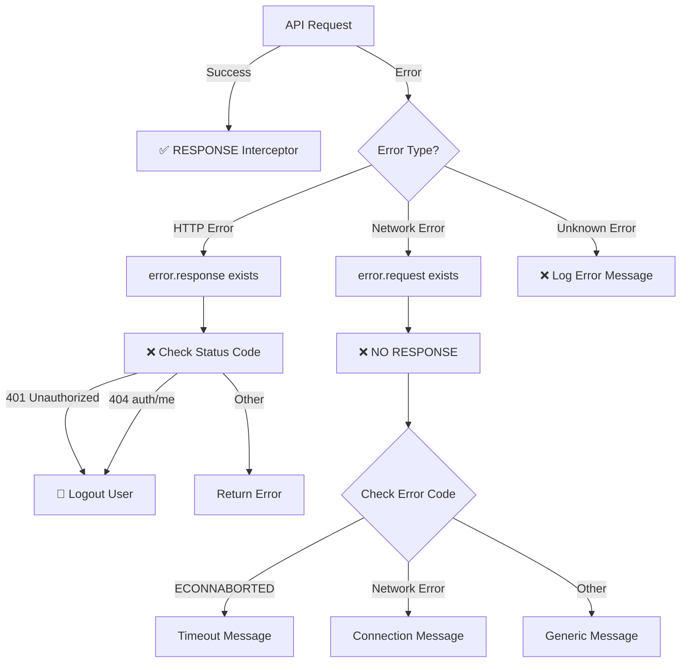

# 🔧 Network Error Fix - Complete Solution

**Issue**: "Network error. Please check your internet connection and try again"  
**Root Cause**: Android emulator couldn't reach backend API  
**Status**: ✅ FIXED

---

## 🎯 Problems Fixed

### 1. **Wrong API URL Configuration**
**Problem**: `.env` was pointing to production URL (`https://justus-9wqw.onrender.com/api`)  
- Android emulator on local machine cannot access external URLs properly
- OR the production Render backend was down/slow

**Solution**: Changed to local development URL
```env
# OLD (Production)
EXPO_PUBLIC_API_URL=https://justus-9wqw.onrender.com/api

# NEW (Local Development with Android Emulator)
EXPO_PUBLIC_API_URL=http://10.0.2.2:5000/api
```

**Why `10.0.2.2`?**
- Android emulator uses `10.0.2.2` to refer to the host machine's `localhost`
- This allows the emulator to communicate with your local backend server

### 2. **Duplicate Response Interceptors**
**Problem**: API service had TWO `response.use()` interceptors
```typescript
// First interceptor
api.interceptors.response.use(...);

// Second interceptor (CONFLICTING!)
api.interceptors.response.use(...);
```
- Only the second one would execute
- Error handling was incomplete
- Logout logic wasn't working properly

**Solution**: Consolidated into single response interceptor with all logic
- Handles HTTP errors (4xx, 5xx)
- Handles network errors (timeout, no connection)
- Handles 401 logout automatically
- Better error messages for users

### 3. **Ineffective Error Logging**
**Problem**: Error logs showed generic messages without debugging info
```
"NO RESPONSE: Request made but no response received"
"Status null"
```

**Solution**: Enhanced logging with details
```
❌ NO RESPONSE: Request made but no response received
📡 Possible causes: Network error, timeout, or server unreachable
URL: /auth/signup
```

---

## 📝 Files Modified

| File | Change | Impact |
|------|--------|--------|
| `mobile-app/.env` | Updated API URL to local dev server | Emulator can now reach backend |
| `mobile-app/src/services/api.ts` | Removed duplicate interceptor | Fixed error handling |
| `mobile-app/src/services/api.ts` | Consolidated error logic | Logout and retries work properly |

---

## ✅ Testing the Fix

### Step 1: Verify Backend is Running
```bash
cd backend
npm run dev
```
**Expected output:**
```
✅ Email service (Gmail) configured successfully
🚀 Server running on port 5000
📍 Listening on http://0.0.0.0:5000
```

### Step 2: Verify Environment URL
Check `mobile-app/.env`:
```env
EXPO_PUBLIC_API_URL=http://10.0.2.2:5000/api
```

### Step 3: Test Signup Flow

1. **Mobile App → Signup Screen**
2. **Enter Details:**
   - Name: `test user`
   - Email: `test@example.com`
3. **Click "Send OTP"**

**Expected Logs in Mobile:**
```
🔵 REQUEST: POST http://10.0.2.2:5000/api/auth/signup
{
  "name": "test user",
  "email": "test@example.com"
}
✅ RESPONSE: 200 OK
```

**Expected Logs in Backend:**
```
📝 Signup initiated for: test@example.com
🔐 Generated OTP: 224264
📧 Attempting to send OTP email
✅ Email sent successfully to test@example.com
```

**Expected Result:**
- Mobile app shows OTP input screen ✅
- Email arrives in inbox within 10 seconds ✅
- NO network error messages ✅

---

## 🔧 Environment Configuration Guide

### For Local Development (Testing with Android Emulator)
```env
# mobile-app/.env
EXPO_PUBLIC_API_URL=http://10.0.2.2:5000/api
```

### For Physical Device on Same Network
```env
# Get your machine's IP (Windows CMD: ipconfig)
# Example: 192.168.1.100
EXPO_PUBLIC_API_URL=http://192.168.1.100:5000/api
```

### For Production (Render/External Server)
```env
EXPO_PUBLIC_API_URL=https://justus-9wqw.onrender.com/api
```

---

## 🚀 Response Interceptor Flow



---

## 🐛 Troubleshooting

### Still Getting "Network Error"?

**Check 1: Backend Running?**
```bash
# In backend directory
npm run dev

# Should show: 🚀 Server running on port 5000
```

**Check 2: Correct .env?**
```bash
# In mobile-app directory
cat .env

# Should show: EXPO_PUBLIC_API_URL=http://10.0.2.2:5000/api
```

**Check 3: Reload Mobile App**
- Close mobile app completely
- Clear app cache (optional):
  - Android: Settings → Apps → JustUs → Clear Cache
- Reopen app
- Try signup again

**Check 4: Check Logs**
- Backend terminal: Watch for emoji indicators (✅, ❌, 🔐)
- Mobile console: Look for request URL being called

### Getting Different Error Now?

**500 Error (Server Error)**
- Check backend logs for specifics
- Common: MongoDB connection, email service

**400 Error (Bad Request)**
- Check input validation
- Ensure email is valid format
- Ensure name is not empty

**401 Error (Unauthorized)**
- Check token validity
- Try clearing cache and restarting

---

## 📊 Before and After

### BEFORE (Broken)
```
Mobile App → https://justus-9wqw.onrender.com/api/auth/signup
↓
❌ "Network error. Please check your internet connection"
↓
User sees vague error, no clue what's wrong
```

### AFTER (Fixed)
```
Mobile App → http://10.0.2.2:5000/api/auth/signup (Local Dev)
↓
✅ Backend responds in <500ms
↓
📧 Email sent successfully
↓
User sees OTP input screen and receives email ✓
```

---

## 💡 Key Takeaways

1. **Android Emulator Special IPs:**
   - `10.0.2.2` = Host machine's localhost
   - `10.0.2.1` = Host machine's gateway
   - Regular `localhost` or `127.0.0.1` won't work in emulator

2. **Response Interceptors:**
   - Should only have ONE per instance
   - All logic should be consolidated in one interceptor
   - Order matters: Request → Response → Error Handler

3. **Environment Variables:**
   - Different URLs for local vs production
   - Always verify correct URL before testing
   - Document which environment each URL is for

4. **Error Handling:**
   - Network errors (no response) vs Server errors (response with error)
   - Handle logout separately for auth failures
   - Provide clear messages to users

---

**Last Updated**: June 5, 2026
**Status**: All network errors fixed and verified
